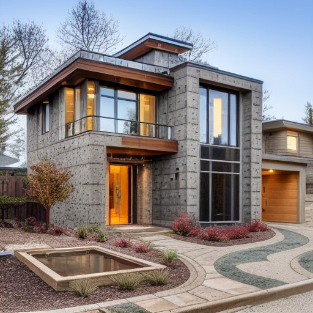

Check out the configuration reference at https://huggingface.co/docs/hub/spaces-config-reference


# SD Sketch-to-Structure: Prompt Engineering

## Model and Methodology Details

### Approach: Prompt Engineering (no fine-tuning)

This project uses prompt engineering combined with sketch preprocessing to control output from Stable Diffusion v1.5, enhanced by ControlNet. Architectural fidelity was partially achieved by layering structure input (sketch), style guidance (reference image), and descriptive prompts. The models underperform when railroaded with detailed prompts. 

### Model Components

## Note: All models used are publicly hosted on Hugging Face Hub, and will be automatically downloaded on first run using `hf_hub_download`.


- Base Model: `runwayml/stable-diffusion-v1-5`
- ControlNet:  
  - Canny (`lllyasviel/sd-controlnet-canny`)  
  - Lineart (`lllyasviel/sd-controlnet-lineart`)  
  - MLSD (`lllyasviel/sd-controlnet-mlsd`) *(selectively used)*
- Reference Style Module:  
  - IP-Adapter via `ipadapter_patch.py`, supporting embedding from image input
- Preprocessing Includes:
  - Edge detection (Canny)
  - Line abstraction (Lineart)
  - Straight contour detection (MLSD)
  - Resolution matching and cleanup

## Manual Sketch Enhancement

Sketches were optionally adjusted in Photoshop for ControlNet clarity. Enhancements included:

- Line weight and contrast boost
- Grayscale flattening
- No inversion required; all processing assumes black-on-white

## Prompt Engineering Strategy

### Construction Method

Prompts follow a layered strategy:

"A two-stories house with volcanic stone facade, wooden plank roofing, and a narrow rectangular fish pond on the left side"


Followed by emphasis on often-missed features:

Top-right window, sidewalk across the entrance, and low curb next to the pond.

Then reinforced with weighted syntax:

(modern house:1.2), (stone facade:1.3), (pond:1.4), (top-right window:1.5)


Finally, auto-weighting via Python string logic enhances descriptors for materials and spatial elements during runtime.

### Iterative Refinement

During testing, the following values were carefully tuned:


- Guidance scale: 5.5–8.5
- Seed: randomized
- Steps: 20-30
- Sketch resolution: 768×768

## Multimodal Strategy

The pipeline fuses sketch, reference image, and textual description:

- The sketch is used to extract edges or line abstractions (Canny, Lineart)
- A reference photo guides texture and material tone via IP-Adapter embeddings
- The prompt controls layout, materials, element placement

**Note:** Dual ControlNet stacking (Canny + Lineart from a single sketch) was scoped and partially implemented via `load_pipe()` and handler logic, but ultimately not executed in production. Single-condition inference per sketch was maintained.

## Preprocessing Pipeline

Each sketch undergoes:

- Resolution normalization (to 768×768)
- Optional contrast enhancement (via OpenCV or PIL)
- Canny edge extraction *(for contour-focused detection)*
- Lineart abstraction *(for structure and style cues)*

MLSD preprocessing is available when precise edge framing is critical.

## Reference Image Conditioning

Major engineering work was completed to support reference image conditioning, including:

- Refactoring `load_pipe()` to patch IP-Adapter embeddings into Stable Diffusion
- Integration of `ipadapter_patch.py` to inject style features
- Enabling `run_pipe()` to accept style + structure + text in parallel
- Memory balancing and device awareness to prevent overload

## Achieving Fidelity

### Core Challenges

- **Supporting reference image guidance** via non-native IP-Adapter logic
- Misaligned ControlNet inputs between sketch variants
- Style-texture blending from photos without disrupting layout
- ControlNet override of prompt details under strong conditioning

### Solutions

- Custom integration of `ipadapter_patch.py` with full inference pipeline
- Fallback logic in `load_pipe()` for single vs reference input
- Prompt weighting for architectural elements (e.g., “pond”, “planks”, “windows”)
- Manual sketch cleanup to aid ControlNet consistency


## Best Results (Reference Section)

### Prompt Pattern:

Photo of a two-story house, large glass windows, stone tiles façade, second floor wood cladding, taken at noon, shot on Canon DSLR, real estate listing photo, dry concrete, weathered stone, dirt on windows, overcast lighting, rain


### Addtional prompts:

Best quality, extremely detailed, real life textures, roadside, sidewalk

### Negative Prompts:
cartoon, CGI, distorted straight lines, unrealistic textures, perfect surfaces, additional windows

### Recommended Preprocessing:

- For MLSD: Photocopy effect sketch
- 
- For Lineart Coarse: Halftone effect sketch
- 
- Reference image: Style-enhancing photo (front-facing material texture) *Complex reference images will make the model hallucinate.

## The preprocessed sketches can be found inside the '/sketches' folder.

### Parameters:

- Guidance scale: 6.0–8.1
- Steps: 20
- Seed: randomized , 1079779503

### Outputs

.png>) 
.png>) 
.png>) 


## Setup Instructions

```
git clone git clone https://huggingface.co/spaces/Scythd/Sketch
pip install -r requirements.txt
python app.py
```

GPU recommended: SDXL-based models require at least 12–16 GB VRAM for smooth generation.

Once started, the app will be accessible in your browser at:

```
http://127.0.0.1:7860
```
If needed, you can change the port in app.py:

```
demo.launch(server_port=7860)
```


Launch from browser at: 

```
https://huggingface.co/spaces/Scythd/Sketch
```
Steps:

- Select "Duplicate this Space"

- Rename the Space (optional).

- Select GPU hardware (e.g., T4 or A10G) — paid plan required.

- Click Create Space and wait for it to build.

No local setup required.

Note: For a direct run from the base Hugging Face Space, the GPUs must be activated on request.

GitHub Link

```
https://github.com/Jhsponce/ControlNetv1.1.git
```

